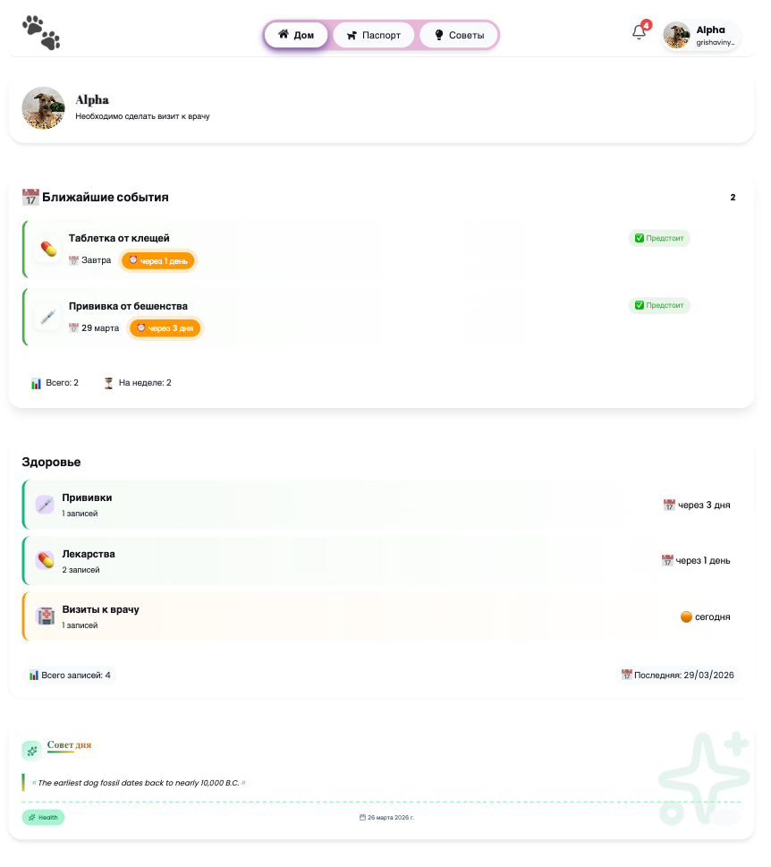
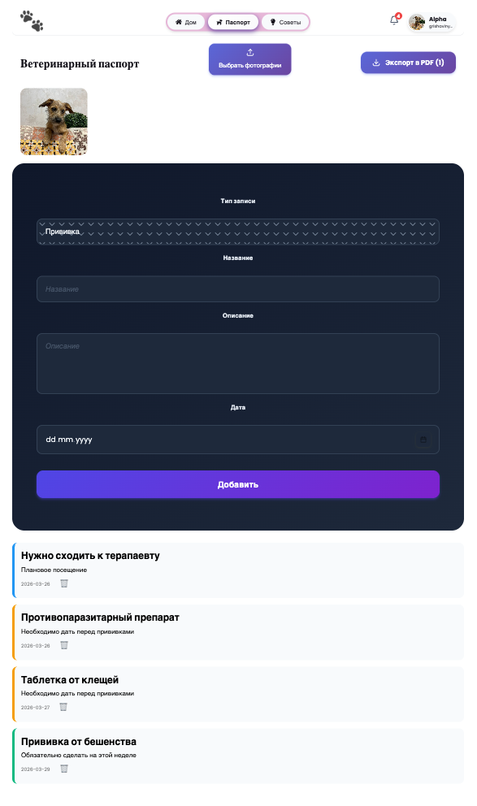
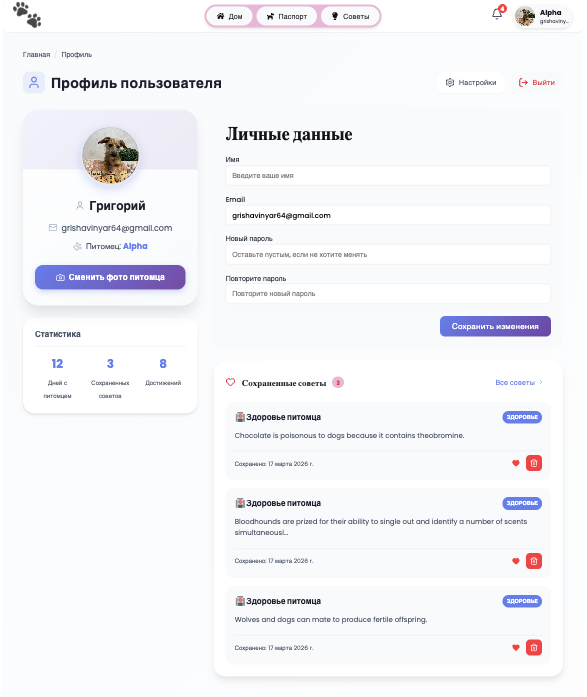

# 🐾 PetCare — Цифровой паспорт здоровья вашего питомца

**PetCare** — это современное веб-приложение для владельцев домашних животных.
Оно помогает вести учёт прививок, лекарств и других важных процедур, заменяя
собой бумажный ветеринарный паспорт. Больше никаких забытых визитов к врачу —
вся информация о здоровье вашего питомца всегда под рукой в телефоне или
компьютере.

---

## ✨ Возможности приложения

- 🐕 **Управление профилем питомца:** Добавляйте фото, имя и другую важную
  информацию.
- 💉 **Учёт прививок:** Ведите календарь с датами, типами вакцин и отслеживайте
  статус выполнения.
- 💊 **Планирование лечения:** Записывайте приём лекарств, витаминов и других
  процедур.
- ⏰ **Умные напоминания:** Приложение подскажет, когда пора делать следующую
  прививку или дать таблетку.
- 📄 **Хранение документов:** Все справки и ветпаспорт в цифровом виде, в одном
  месте.
- 📚 **Полезные советы:** Раздел с актуальной информацией об уходе, питании и
  воспитании питомцев.
- 👤 **Личный кабинет:** Настройки профиля пользователя для персонализации
  опыта.

## 🎯 Для кого это приложение

- Владельцы собак, кошек и других домашних животных.
- Те, кто хочет системно заботиться о здоровье своего питомца.
- Пользователи, которые ценят удобство цифровых инструментов вместо бумажных
  записей.
- Все, кому нравится простой, интуитивно понятный и эстетичный интерфейс.

---

## 🛠️ Технологический стек

### Frontend

- **Языки:** TypeScript
- **Фреймворк:** React 19
- **Сборка:** Vite
- **Стилизация:** SCSS Modules
- **Управление состоянием:** Context API
- **Маршрутизация:** React Router DOM v7
- **UI-библиотека:** Lucide React, React Icons

### Backend & Database

- **Backend as a Service:** Supabase
- **Аутентификация и БД:** @supabase/supabase-js

### Тестирование

- **Юнит-тесты и интеграция:** Vitest
- **UI-тестирование:** React Testing Library
- **Среда тестирования:** JSDOM

### Дополнительные инструменты

- **Генерация PDF:** jsPDF
- **Хеширование:** Spark MD5
- **Линтинг:** ESLint
- **Форматирование:** TypeScript ESLint

---

## 📐 Архитектура проекта

Проект построен на основе принципов **Feature-Sliced Design (FSD)**.

В данной реализации используется **облегчённая версия FSD**, что позволило
быстро начать разработку MVP без избыточного усложнения, но с заделом на будущее
расширение функциональности.

- **`app/`** — настройки приложения, провайдеры, глобальные стили.
- **`pages/`** — композиция фич и виджетов для конкретных страниц.
- **`features/`** — пользовательские сценарии (добавление прививки,
  редактирование профиля и т.д.).
- **`entities/`** — бизнес-сущности (питомец, пользователь, напоминание).
- **`shared/`** — переиспользуемые UI-компоненты, утилиты, API.

\_Такой подход позволяет легко добавлять новый функционал, не боясь сломать
существующий.
